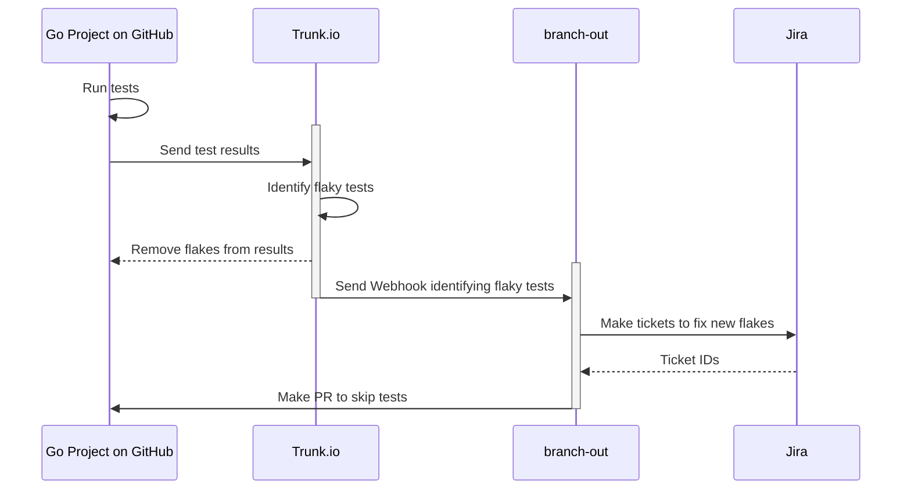

# Branch Out

A tool to accentuate the capabilities of [Trunk.io](https://trunk.io/)'s [flaky test tools](https://docs.trunk.io/flaky-tests/overview). When a test is detected as flaky, [Trunk.io sends a webhook](https://docs.trunk.io/flaky-tests/webhooks). From there, we can branch out to different services to customize the flaky test quarantine process.

## Run

```sh
# See the help command for detailed instructions on how to run branch-out
branch-out --help
```

## Flow



## Configuration

Configuration is fetched in this priority order:

1. CLI Flags (e.g. `--github-token <token-value>`)
2. Env Vars
3. A `.env` file. See [.env.example](./.env.example)

## Contributing

We use [golangci-lint v2](https://golangci-lint.run/) for linting and formatting, and [pre-commit](https://pre-commit.com/) for pre-commit and pre-push checks.

```sh
pre-commit install # Install our pre-commit scripts
```

See the [Makefile](./Makefile) for helpful commands for local development.

```sh
make generate             # Generate docs
make lint                 # Lint and format code
make test                 # Run all tests
make test_race            # Run all tests with race detection
make test_short           # Run all `short` tests
make test_integration     # Only run Integration tests
make test_example_project # Run example tests in the example_project directory
```
