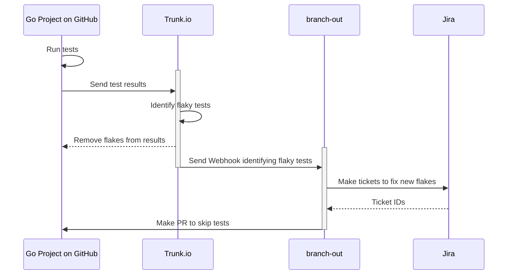

# Branch Out

A tool to accentuate the capabilities of [Trunk.io](https://trunk.io/)'s [flaky test tools](https://docs.trunk.io/flaky-tests/overview).

## Design

### Desired Flow

1. Tests are run on develop
2. Results uploaded to Trunk
3. Trunk detects some flaky tests, marks them as quarantined and skips them with CI magic.
4. Trunk tells us they skipped a test
5. We branch out and create:
   1. Jira Ticket to assign someone to fix the test and link it with Trunk's system
   2. GitHub PR to modify the code with `t.Skip("Quarantined test due to flakiness <Jira Ticket>")` calls.
   3. (bonus) GitHub Issue to fix the flaky test. Ask GitHub Copilot for a PR attempt.



## // TODO:

### `package server`

- Properly exposed webhook endpoint
- Better error handling
- Run cron job for sync checks?
- Test reliability

### `package trunk`

- Validate and act on [trunk webhook calls](https://docs.trunk.io/flaky-tests/webhooks)
- Utilize [Trunk API calls](https://docs.trunk.io/references/apis#authentication) for scheduled checks and linking Jira tickets

### `package golang`

- Validate `QuarantineModeComment`
- Expand ability to quarantine tests. We can only do basic ones right now, see the [the integration test](./golang/quarantine_integration_test.go)

### `package github`

- Test out current approach

### `package jira`

- Create new tickets
- Update existing tickets

### Infra

- Find a place for this app to live
- Find a way to expose our URL so Trunk can hit our webhooks

## Configuration

### Environment Variables

The application uses the following environment variables:

#### Jira Integration (Required for ticket creation)

- `JIRA_BASE_DOMAIN`: Your Jira domain (e.g., `your-company.atlassian.net`)
- `JIRA_PROJECT_KEY`: The project key where tickets will be created (e.g., `PROJ`)

**OAuth Authentication (Recommended):**

- `JIRA_CLIENT_ID`: OAuth client ID
- `JIRA_CLIENT_SECRET`: OAuth client secret
- `JIRA_ACCESS_TOKEN`: OAuth access token
- `JIRA_REFRESH_TOKEN`: OAuth refresh token

**Basic Authentication (Alternative):**

- `JIRA_USERNAME`: Your Jira username/email
- `JIRA_API_TOKEN`: Your Jira API token

#### Trunk.io Integration (Optional for ticket linking)

- `TRUNK_API_TOKEN`: API token for linking Jira tickets back to Trunk test cases

## Features

### Jira Ticket Creation

When a test case status changes to "flaky" (or similar), the webhook will:

1. Create a detailed Jira ticket with test failure information
2. Include metadata like failure rate, impacted PRs, and codeowners
3. Create a ticket if the test case does not already have one or if it's closed. If the test case already has a Jira ticket, it will comment on the existing ticket with the new flaky status.

### Trunk.io Integration

After creating a Jira ticket, the system will:

1. Link the ticket back to the Trunk test case via API
2. Enable seamless navigation between Jira and Trunk
3. Gracefully handle cases where the API token is not configured

## Webhook Events

The application currently handles `test_case.status_changed` events from Trunk.io with the following logic:

- Only processes status changes to flaky-related statuses
- Checks for existing tickets to avoid duplicates

## API Endpoints

### Webhook Receiver

- **Endpoint**: `/webhook/trunk`
- **Method**: POST
- **Purpose**: Receives `test_case.status_changed` events from Trunk.io
- **Authentication**: None (webhook verification should be added)

## Contributing

We use [golangci-lint v2](https://golangci-lint.run/) for linting and formatting, and [pre-commit](https://pre-commit.com/) for pre-commit and pre-push checks.

```sh
pre-commit install # Install our pre-commit scripts
```

See the [Makefile](./Makefile) for helpful commands for local development.

```sh
make build                # Build binaries, results placed in dist/
make lint                 # Lint and format code

make test                 # Run all tests
make test_race            # Run all tests with race detection
make test_short           # Run all `short` tests
make test_integration     # Only run Integration tests
make test_example_project # Run example tests in the example_project directory

```

## Examples

### Jira Integration Example

```shell
# Run the Jira example
go run examples/jira/main.go
```

### Trunk.io Integration Example

```shell
# Run the Trunk example
go run examples/trunk/main.go
```
