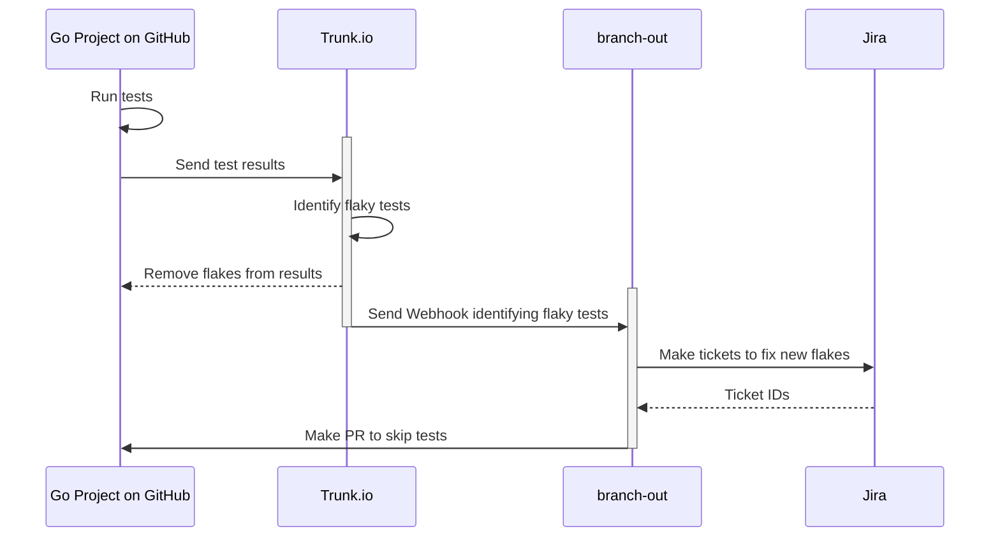

# Branch Out

A tool to accentuate the capabilities of [Trunk.io](https://trunk.io/)'s [flaky test tools](https://docs.trunk.io/flaky-tests/overview).

## Design

### Desired Flow

1. Tests are run on develop
2. Results uploaded to Trunk
3. Trunk detects some flaky tests, marks them as quarantined and skips them with CI magic.
4. Trunk tells us they skipped a test
5. We branch out and create:
   1. Jira Ticket to assign someone to fix the test and link it with Trunk's system
   2. GitHub PR to modify the code with `t.Skip("Quarantined test due to flakiness <Jira Ticket>")` calls.
   4. (bonus) GitHub Issue to fix the flaky test. Ask GitHub Copilot for a PR attempt.




## // TODO:

### `package server`

* Properly exposed webhook endpoint
* Better error handling
* Run cron job for sync checks?
* Test reliability

### `package trunk`

* Validate and act on [trunk webhook calls](https://docs.trunk.io/flaky-tests/webhooks)
* Utilize [Trunk API calls](https://docs.trunk.io/references/apis#authentication) for scheduled checks and linking Jira tickets

### `package golang`

* Validate `QuarantineModeComment`
* Expand ability to quarantine tests. We can only do basic ones right now, see the [the integration test](./golang/quarantine_integration_test.go)

### `package github`

* Test out current approach

### `package jira`

* Create new tickets
* Update existing tickets

### Infra

* Find a place for this app to live
* Find a way to expose our URL so Trunk can hit our webhooks

## Contributing

We use [golangci-lint v2](https://golangci-lint.run/) for linting and formatting, and [pre-commit](https://pre-commit.com/) for pre-commit and pre-push checks.

```sh
pre-commit install # Install our pre-commit scripts
```

See the [Makefile](./Makefile) for helpful commands for local development.

```sh
make build                # Build binaries, results placed in dist/
make lint                 # Lint and format code

make test                 # Run all tests
make test_race            # Run all tests with race detection
make test_short           # Run all `short` tests
make test_integration     # Only run Integration tests
make test_example_project # Run example tests in the example_project directory

```
