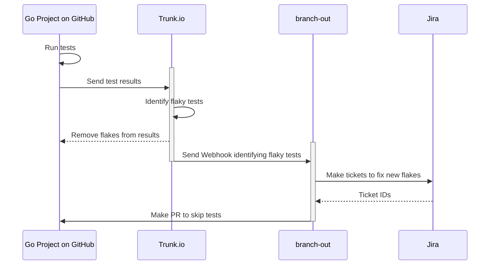

# Design

## High-Level Flow

```mermaid
sequenceDiagram
  participant g as Go Project on GitHub
  participant t as Trunk.io
  participant bo as branch-out
  participant j as Jira

  g->>g: Run tests
  activate t
  g->>t: Send test results
  t->>t: Identify flaky tests
  t-->>g: Remove flakes from results
  activate bo
  t->>bo: Send Webhook identifying flaky tests
  deactivate t
  bo->>j: Make tickets to fix new flakes
  j-->>bo: Ticket IDs
  bo->>g: Make PR to skip tests
  deactivate bo
```
